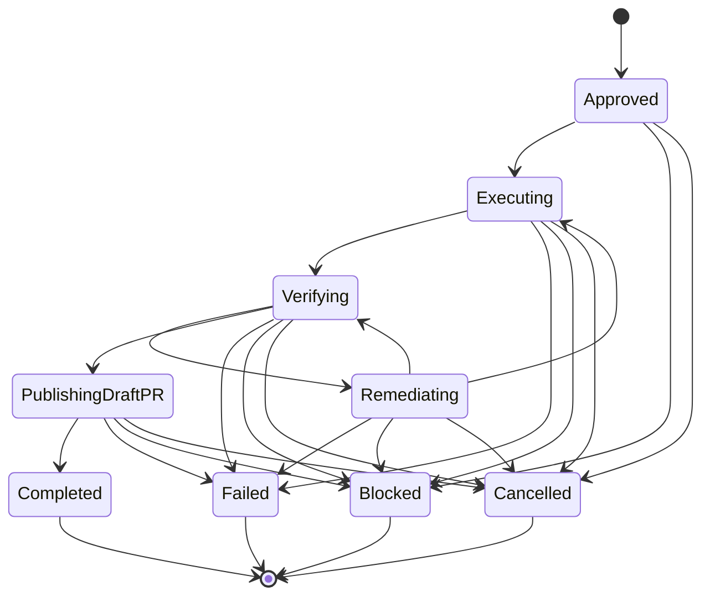

# WorkRun lifecycle

A `WorkRun` represents one approved Jira work item as it moves through governed
execution. The model is immutable and independent of orchestration frameworks.

## Domain rules

- `approved`, `executing`, `verifying`, `remediating`, and
  `publishing_draft_pr` are active stages.
- `completed`, `failed`, `blocked`, and `cancelled` are terminal outcomes. No
  transition can leave a terminal outcome.
- Completion is only valid after Draft PR publication and requires a correlated
  HTTPS pull-request URL.
- A remediation pass may return to execution when code changes are needed or
  directly to verification when only verification inputs changed.
- Identity, Jira issue, repository, branch, Agent Assembly correlation, artifact,
  and event references survive every transition.
- Reference URLs reject embedded credentials so persisted domain data cannot
  accidentally retain URL-based secrets.
